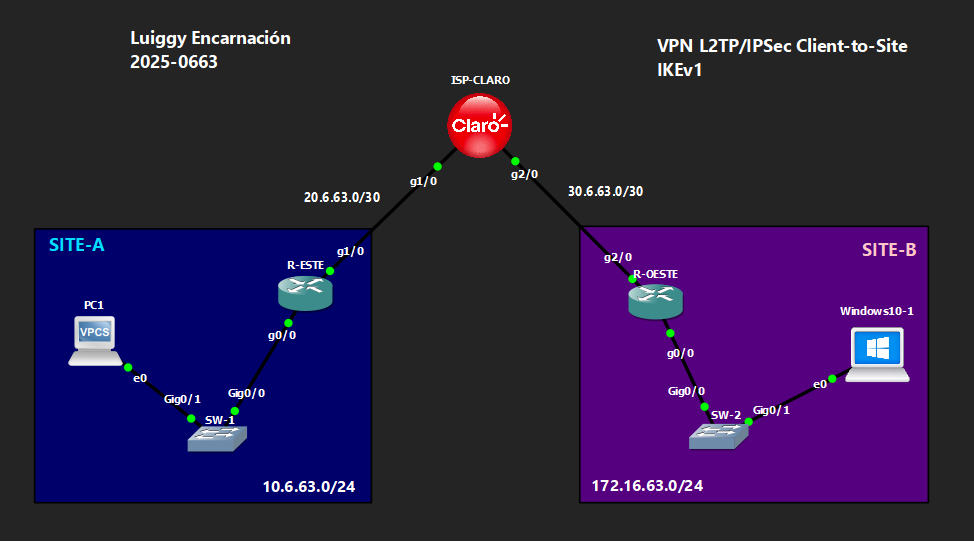

# 🔒 VPN Client-to-Site L2TP/IPSec — IKEv1

**Luiggy Habraham Encarnación Cabrera · Matrícula 2025-0663**


> VPN de acceso remoto individual (client-to-site) usando L2TP sobre IPSec con IKEv1 y autenticación PPP MS-CHAPv2.

---

## 📑 Tabla de Contenido

1. [Objetivo del Laboratorio](#-objetivo-del-laboratorio)
2. [Parámetros Usados](#-parámetros-usados)
3. [Documentación de la Red](#️-documentación-de-la-red)
4. [Funcionamiento de la VPN](#-funcionamiento-de-la-vpn)
5. [Configuración](#-configuración)
6. [Verificación](#-verificación)
7. [Capturas de Pantalla](#-capturas-de-pantalla)
8. [Video de Demostración](#-video-de-demostración)

---

## 🎯 Objetivo del Laboratorio

Configurar una VPN **client-to-site** usando **L2TP sobre IPSec** con **IKEv1**, donde R-ESTE actúa como **concentrador VPN (LNS)** que acepta conexiones entrantes de un cliente remoto (Windows10-1, ubicado en SITE-B) mediante un `crypto dynamic-map` y autenticación **PPP con MS-CHAPv2**. El objetivo es entender el modelo de acceso remoto individual (usuario final conectándose a la red corporativa), distinto de las VPN site-to-site entre routers.

---

## 🧩 Parámetros Usados

| Parámetro | Valor |
|---|---|
| Versión IKE | IKEv1 (ISAKMP) |
| Cifrado Fase 1 | 3DES |
| Hash Fase 1 | SHA |
| Autenticación Fase 1 | Pre-shared key (`Luiggy20250663!`), aceptada desde cualquier IP |
| Grupo DH | 2 |
| Transform-set (Fase 2) | esp-3des / esp-sha-hmac |
| Modo IPSec | Transporte |
| Crypto map | Dinámico (`crypto dynamic-map` + `set nat demux`) |
| Túnel de datos | L2TP (`vpdn-group`, `accept-dialin`, `virtual-template`) |
| Autenticación de usuario | PPP MS-CHAPv2 vía AAA local |
| Usuario configurado | `luiggy` |
| Pool de direcciones VPN | 192.168.63.10 – 192.168.63.150 |
| NAT | `overload` (PAT) sobre interfaz WAN, incluye LAN local y pool VPN |

---

## 🗺️ Documentación de la Red

### Topología



### Tabla de Direccionamiento

| Dispositivo | Interfaz | IP | Red |
|---|---|---|---|
| ISP-CLARO | g1/0 | 20.6.63.2/30 | Enlace hacia R-ESTE |
| ISP-CLARO | g2/0 | 30.6.63.2/30 | Enlace hacia R-OESTE |
| ISP-CLARO | Lo0 | 20.20.20.20/32 | Loopback de pruebas |
| R-ESTE (LNS) | g1/0 (WAN) | 20.6.63.1/30 | Hacia ISP (NAT outside) |
| R-ESTE (LNS) | g0/0 (LAN) | 10.6.63.1/24 | SITE-A (NAT inside) |
| R-ESTE (LNS) | Pool VPN | 192.168.63.10–192.168.63.150 | Direcciones asignadas a clientes remotos |
| R-OESTE | g2/0 (WAN) | 30.6.63.1/30 | Hacia ISP (NAT outside) |
| R-OESTE | g0/0 (LAN) | 172.16.63.1/24 | SITE-B (NAT inside) |
| Windows10-1 | — | DHCP en 172.16.63.0/24 | Cliente que inicia la conexión L2TP/IPSec hacia R-ESTE |

### Detalles del Entorno

| Parámetro | Valor |
|---|---|
| Emulador | GNS3 / Packet Tracer |
| Dispositivos Cisco | IOU / Router IOS |
| Cliente VPN | Windows 10 (o Linux con NetworkManager-l2tp) |
| VLANs | VLAN 1 (default) en SW-1 y SW-2 |

---

## 🔬 Funcionamiento de la VPN

**Autenticación de usuarios (AAA local):**
- `aaa new-model` habilita el subsistema AAA.
- `aaa authentication ppp VPN-AUTH-USERS local` y `aaa authorization network VPN-AUTHOR-USERS local` usan la base de usuarios local del router.
- `username luiggy password Luiggy20250663!` es la credencial que el cliente Windows usará para autenticar la conexión VPN.

**Fase 1 (ISAKMP/IKEv1) — modo dinámico:**
- `crypto isakmp policy 10`: 3DES, SHA, pre-share, grupo 2 (nivel más bajo, priorizando compatibilidad con clientes VPN nativos de Windows).
- `crypto isakmp key Luiggy20250663! address 0.0.0.0 0.0.0.0`: acepta conexiones desde **cualquier IP pública**, ya que el cliente remoto puede tener IP dinámica.

**Fase 2 (IPSec) + crypto dynamic-map:**
- `crypto ipsec transform-set VPN-SET esp-3des esp-sha-hmac` en modo transporte.
- `crypto dynamic-map VPN-DYN 10` con `set nat demux`: construye las SAs de IPSec **sobre la marcha**, sin conocer de antemano la IP del cliente.
- `crypto map VPN 10 ipsec-isakmp dynamic VPN-DYN` amarra el mapa dinámico a la interfaz WAN.

**L2TP + PPP:**
- `vpdn enable` y `vpdn-group L2TP` con `protocol l2tp` y `accept-dialin` habilitan al router como servidor L2TP.
- `interface Virtual-Template1`: plantilla clonada dinámicamente en una interfaz `Virtual-Access` por cada cliente; usa `ppp authentication ms-chap-v2` y asigna IP desde `ip local pool VPN-POOL`.
- **NAT**: el tráfico del cliente remoto sale a través de `ip nat inside source list NAT_ACL ... overload`, incluyendo LAN local y pool de direcciones VPN.

**Flujo completo:** el cliente Windows negocia primero IPSec (Fase 1 + Fase 2 vía dynamic-map) para cifrar el canal, y **dentro** de ese túnel cifrado se levanta la sesión L2TP/PPP donde ocurre la autenticación de usuario y la asignación de IP.

---

## 🔧 Configuración

Ver archivo: `config.txt`

---

## ✅ Verificación

```
show crypto isakmp sa
show crypto ipsec sa
show vpdn session
show ip interface brief
show users
```

Se espera:
- `show crypto isakmp sa` → SA levantada dinámicamente cuando el cliente inicia la conexión.
- `show vpdn session` → sesión L2TP activa con el usuario `luiggy`.
- `show ip interface brief` → interfaz `Virtual-Access` clonada de `Virtual-Template1`, en estado up/up.
- `show users` → sesión de línea virtual asociada a la IP asignada del pool `192.168.63.10–150`.

---

## 📸 Capturas de Pantalla

```
images/
├── 01_topologia.png
├── 02_show_crypto_isakmp_sa.png
├── 03_show_crypto_ipsec_sa.png
├── 04_show_vpdn_session.png
├── 05_show_ip_interface_brief.png
├── 06_show_users.png
├── 07_cliente_vpn_conectado.png
└── 08_interfaz_LAN_cliente_vpn.png
```

---

## 🎬 Video de Demostración

> 📺 **[Ver demostración en YouTube →](https://youtu.be/6oi4B4AzYZI)**
